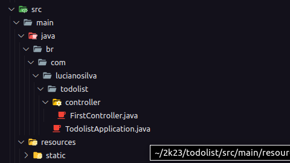
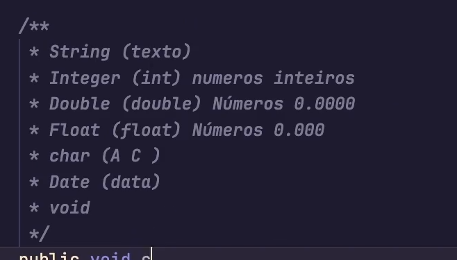

em java as classes tem que estar dentro de um peckage.
packages são classes ou interfaces que podem ser reutilizadas.

O que eu conheço como decorators aqui no java é anotation que são funções e eu defino a minha classe com ela.

vou criar as controller e colocar as notattion @Controller e @RestController;
- Controller usa-se pra fazer qualquer tipo de controller seria a mais genérica;
- RestController para usar o padrão Rest

Aqui o java é recursivo então os arquivos tem de estar organizados dessa forma ou não irão carregar corretamente.

modificadores:

public
private
protected

LOMBOK
[lombok maven docs](https://projectlombok.org/setup/maven)

lombok faz o processo de getters e setters sem eu ter que fazer manualmente em todos os atributos da minha classe

Todas as requisições estão passando pelo filtro antes de ir para rota

estamos fazendo a parte de autenticação com basic auth que criptografa com Bcrypt e descriptografa com base64