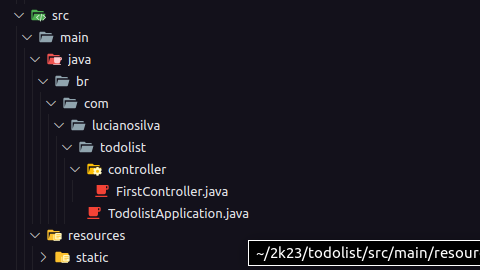
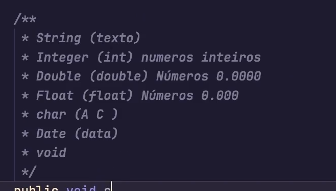

# Todo-app

Projeto Todo-App

## Descrição

Este projeto é um aplicativo To-Do simples criado durante um workshop de uma semana. O objetivo principal era praticar operações CRUD em Java com a utilização de várias tecnologias. O aplicativo permite aos usuários gerenciar tarefas, incluindo criar, ler, atualizar e excluir tarefas.

## Tecnologias Utilizadas

- Java 17
- Spring Boot
- H2 Database (em memória)
- Lombok
- BCrypt (para criptografar a senha do usuário)
- Render.com (para hospedagem)
- Visual Studio Code (IDE)
- Extensões do VS Code utilizadas:
  - vscjava.vscode-java-pack
  - vscjava.vscode-java-debug
  - vscjava.vscode-java-test
  - vscjava.vscode-java-dependency
  - vscjava.vscode-maven
  - redhat.java
  - vscjava.vscode-spring-initializr
  - vmware.vscode-spring-boot
  - vscjava.vscode-spring-boot-dashboard
- Cliente HTTP: Insomnia

## Pré-Requisitos

Antes de começar, certifique-se de ter as seguintes ferramentas instaladas:

- [Java 17](https://www.oracle.com/java/technologies/javase-downloads.html)
- [Maven](https://maven.apache.org/)
- [Visual Studio Code](https://code.visualstudio.com/) com as extensões listadas acima.
- [Insomnia](https://insomnia.rest/) ou qualquer outro client http.

## Instalação e Execução

Siga estas etapas para executar o projeto localmente:

1. Clone o repositório para a sua máquina local.

```bash
  git clone https://github.com/seu-usuario/nome-do-repositorio.git
```

2. Abra o projeto no Visual Studio Code.

3. instale todas as extensões:

- Extensões do VS Code utilizadas:
  - vscjava.vscode-java-pack
  - vscjava.vscode-java-debug
  - vscjava.vscode-java-test
  - vscjava.vscode-java-dependency
  - vscjava.vscode-maven
  - redhat.java
  - vscjava.vscode-spring-initializr
  - vmware.vscode-spring-boot
  - vscjava.vscode-spring-boot-dashboard

Você pode fazer isso a partir do Visual Studio Code ou utilizando o Maven. Certifique-se de que o banco de dados H2 esteja configurado para rodar na memória.

4. Use o Insomnia ou outra ferramenta de cliente HTTP para testar as rotas do aplicativo.

### Rotas Protegidas

| Rota              | Protegida | Descrição                                    |
| ----------------- | --------- | -------------------------------------------- |
| `/api/tasks`      | Sim       | Listar todas as tarefas (Autenticação Basic) |
| `/api/tasks`      | Sim       | Criar uma nova tarefa (Autenticação Basic)   |
| `/api/tasks/{id}` | Sim       | Atualizar uma tarefa (Autenticação Basic)    |
| `/api/users`      | Não       | Criar um novo usuário                        |

### Anotações

- Lembre-se de configurar as credenciais de autenticação ao acessar as rotas protegidas. Utilize o cabeçalho `Authorization` com o valor `Basic {base64(user:password)}`.
- Certifique-se de que o banco de dados H2 esteja configurado para rodar na memória e que os scripts SQL necessários estejam presentes em `src/main/resources`.
- Ao implantar o aplicativo no Render.com, siga as instruções específicas da plataforma para garantir um deploy bem-sucedido.
- Para realizar testes nas rotas, utilize o cliente HTTP Insomnia ou qualquer outra ferramenta semelhante.
- Este é um projeto simples para fins de aprendizado e prática. Sinta-se à vontade para personalizá-lo e expandi-lo de acordo com suas necessidades.

Adicione suas anotações adicionais conforme necessário.

<details>
 <summary>Anotações</summary>
 em java as classes tem que estar dentro de um peckage.
packages são classes ou interfaces que podem ser reutilizadas.

O que eu conheço como decorators aqui no java é anotation que são funções e eu defino a minha classe com ela.

vou criar as controller e colocar as notattion @Controller e @RestController;

- Controller usa-se pra fazer qualquer tipo de controller seria a mais genérica;
- RestController para usar o padrão Rest

Aqui o java é recursivo então os arquivos tem de estar organizados dessa forma ou não irão carregar corretamente.


modificadores:

public
private
protected



LOMBOK
[lombok maven docs](https://projectlombok.org/setup/maven)

lombok faz o processo de getters e setters sem eu ter que fazer manualmente em todos os atributos da minha classe

Todas as requisições estão passando pelo filtro antes de ir para rota

estamos fazendo a parte de autenticação com basic auth que criptografa com Bcrypt e descriptografa com base64

alguns comandos para o maven.

```bash
sudo add-apt-repository ppa:linuxuprising/java
sudo apt-get update
sudo apt-get install oracle-java17-installer --install-recommends
sudo apt-get update
sudo apt-get -y install maven
mvn -version
vim /etc/profile
find /usr/share/maven
mvn -version
sudo apt-get clean
rm -rf /var/lib/apt/lists/*
sudo rm -rf /var/lib/apt/lists/*
sudo apt-get clean
sudo apt-get update
sudo apt-get upgrade
mvn spring-boot:run
mvn clean install

```

</details>

### Links importantes

[guia iniciante java](https://efficient-sloth-d85.notion.site/Curso-de-Java-2408d11bfc3447e980fe9460b6293976)
